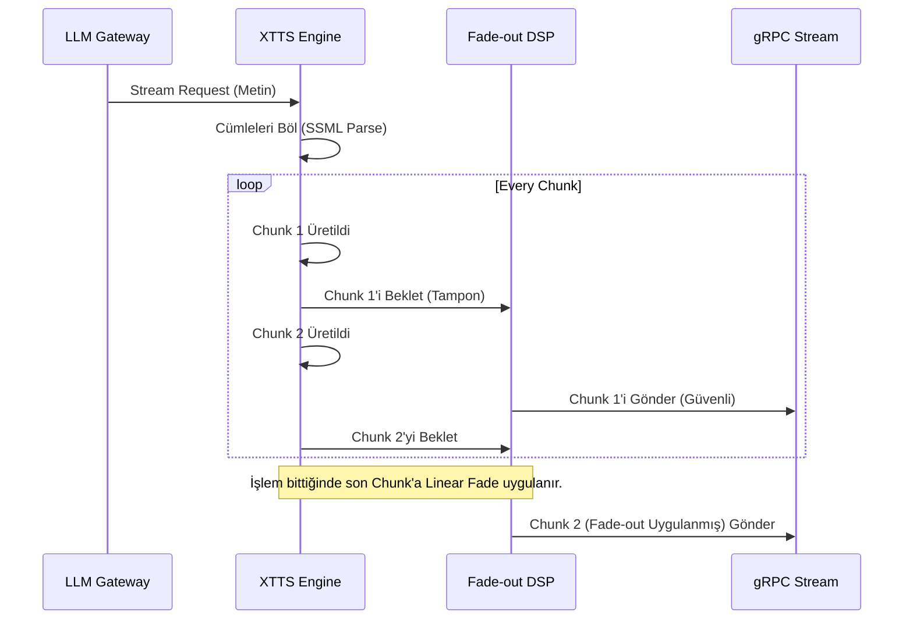

# 🧬 TTS Coqui DSP & VRAM Management Logic

Bu belge, `sentiric-tts-coqui-service`'in saf PyTorch modelinden ayrılarak nasıl "Stüdyo Kalitesinde" (Artifact-Free) ve sıfır gecikmeli bir sunucuya dönüştüğünü açıklar.

## 1. Look-Ahead Buffering ve Mathematical Fade-Out
Standart TTS streaming motorlarında, ses parçaları (chunk) üretildikçe cümlenin en sonunda "pıt", "tıss" gibi kopma sesleri (Audio Artifacts) oluşur.
*   **Algoritma:** Sistem, stream edilen ses paketlerini bir adım geriden takip eder (`last_chunk_np`). Son paketin geldiği anlaşıldığında, paket ağa gönderilmeden önce NumPy tensörü üzerinde bir maskeleme yapılır.
*   **Uygulama:** Ses genliği (Amplitude) eşik değerinin altındaysa (`threshold=0.025`), son `N` örneğe doğrusal bir matematiksel eğri (`np.linspace(1.0, 0.0)`) çarpılarak ses pürüzsüzce sönümlenir (Fade-out).

## 2. Deterministic Caching (MD5 Based Zero-Latency)
Gelen metin tamamen aynı olsa bile eski sistemler UUID kullandığı için GPU her seferinde boş yere çalışır (RTF > 0.3).
*   **Algoritma:** Gelen istek parametrelerinin tamamı (Metin + Dil + Speaker_Idx + Hız + Sıcaklık) sıralanıp (sort_keys=True) deterministik bir **MD5 Hash** üretilir.
*   **Sonuç:** Eğer bu Hash diskin `cache/` klasöründe mevcutsa, GPU hiç tetiklenmez. Dosya doğrudan okunur ve `0.0007` RTF değeri ile (neredeyse 0ms gecikme) geri dönülür.

## 3. Smart VRAM Garbage Collector
Her inference sonrası `torch.cuda.empty_cache()` çağırmak, CUDA Context senkronizasyonu yüzünden her çağrıya +300ms gecikme (latency penalty) ekler.
*   **Algoritma:** `SmartMemoryManager` sınıfı, GPU belleğini pasif olarak izler. Sadece VRAM ayrılmış belleği `4500MB` sınırını aştığında VEYA her `10` istekte bir periyodik olarak (Request Modulo) `gc.collect()` çağırır. Bu yaklaşım Darboğazı (Bottleneck) tamamen engeller.

## 4. Güvenli SSML (Billion Laughs Koruması)
Kullanıcıdan gelen `<speak>` etiketli metinler XML parser'a girer.
*   Kötü niyetli aktörlerin XML Entity Expansion (Billion Laughs) saldırısı ile sunucu belleğini tüketmesini engellemek için, Python standart kütüphanesi yerine **`defusedxml`** kullanılır. Parse hatası durumunda 500 kodu dönmek yerine sistem "Plain-Text Fallback" moduna geçer.
